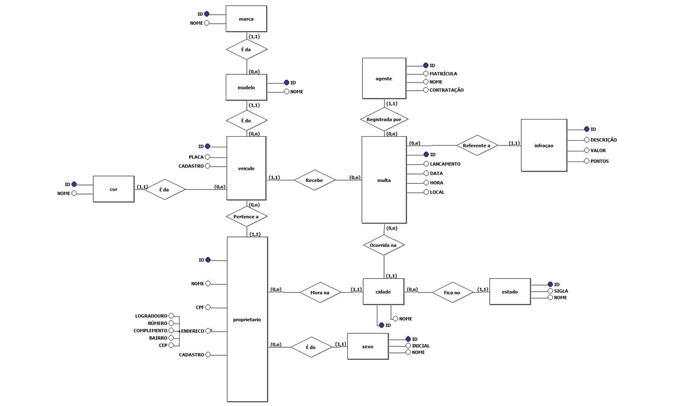

# 🚀 Benchmark MongoDB

Este projeto realiza um **benchmark de desempenho** focado em simular um ambiente realista de banco de dados utilizando **MongoDB**.

---

## 📂 Estrutura do Banco de Dados

O banco foi modelado a partir de um DER(Diagrama Entidade Relacionamento) de uma estrutura relacional, que simula um sistema de gerenciamento de veículos e multas do detran. Confira o modelo usado de exemplo:



### 📁 Coleções

<details>
  <summary>Ver estrutura</summary>

- **marca**
  - `_id`
  - `nome`

- **cor**
  - `_id`
  - `nome`

- **modelo**
  - `_id`
  - `nome`
  - `marca_id`

- **estado**
  - `_id`
  - `sigla`
  - `nome`

- **cidade**
  - `_id`
  - `nome`
  - `estado_id`

- **agente**
  - `_id`
  - `matricula`
  - `nome`
  - `contratacao`

- **infracao**
  - `_id`
  - `descricao`
  - `valor`
  - `pontos`

- **proprietario**
  - `_id`
  - `nome`
  - `cidade_id`
  - `sexo`
  - `cpf`
  - `endereco`
    - `logradouro`
    - `numero`
    - `complemento`
    - `bairro`
    - `cep`

- **veiculo**
  - `_id`
  - `modelo_id`
  - `proprietario_id`
  - `cor_id`
  - `placa`
  - `cadastro`

- **multa**
  - `_id`
  - `agente_id`
  - `veiculo_id`
  - `cidade_id`
  - `infracao_id`
  - `lancamento`
  - `data_multa`
  - `hora`
  - `local_multa`
</details>

---

## 📊 Documentos por Coleção

| Coleção        | Número de Documentos |
|----------------|----------------------|
| marca          | 20                   |
| cor            | 30                   |
| modelo         | 40                   |
| estado         | 27                   |
| cidade         | 54                   |
| agente         | 1000                 |
| infracao       | 50                   |
| proprietario   | 5000                 |
| veiculo        | 10000                |
| multa          | 12000                |

---

## 💾 Como usar o banco

Existem duas formas de utilizar a database em sua máquina:

### 1. 🛠️ Usando os MongoDB Tools (linha de comando)

<details>
  <summary>Passo a passo</summary>

- Verifique se o MongoDB está instalado na sua máquina.
- Baixe e instale os **MongoDB Database Tools**
- No repositório, descompacte o arquivo `dump.zip`. Ele contém os dados de exemplo do banco.
- Depois disso, execute o comando abaixo no terminal para restaurar os dados no MongoDB:

```bash
mongorestore --db detran ./dump
```

O comando acima irá inserir todos os dados do dump automaticamente no banco especificado.

</details>

### 2. 🧭 Usando o MongoDB Compass 

<details> 
<summary>Passo a passo</summary>

1. Abra o MongoDB Compass e clique em **"Create Database"**.
2. Dê um nome ao banco de dados.
3. No repositório, descompacte o arquivo `data.zip`. Dentro dele você encontrará:
   - Um arquivo `colecoes.txt` com os nomes das coleções que precisam ser criadas.
   - Arquivos `.json` com os dados de cada coleção (ex: `cor.json`).

4. Crie manualmente cada coleção:
   - No Compass, clique em **"Create Collection"**.
   - Use os nomes presentes no arquivo `colecoes.txt`.

5. Para importar os dados:
   - Acesse a coleção desejada (ex: `cor`).
   - Clique em **"Add Data" → "Import JSON"**.
   - Selecione o arquivo correspondente (`cor.json`, por exemplo) dentro da pasta extraída do `data.zip`.

</details>

---

## 🧪 Objetivo do Benchmark

- Avaliar o desempenho das consultas com múltiplos níveis de relacionamento.
- Comparar consultas através do uso de índices.
- Observar o comportamento do MongoDB com volume moderado de dados.

---

## ⚙️ Ferramentas Utilizadas

- **MongoDB** (v5.0.31)
- **MongoDB Compass** (v1.46.0)
- **Mongodump** (v100.12.0)
- **Mockaroo** (para geração de dados)
- **ChatGPT** (para geração de dados)

---

## 📌 Notas

- Todos os dados utilizados neste benchmark são gerados artificialmente e destinados apenas para fins acadêmicos e de teste.
- Fruto das aulas de Banco nao relacional pela Fatec Jahu, ministradas pelo [Professor Tiago](https://github.com/tiagotas)